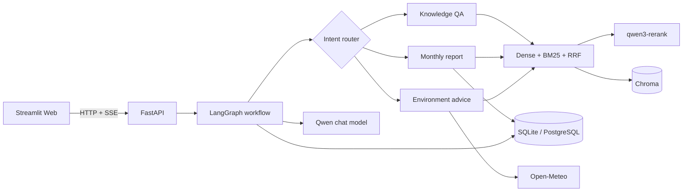

# CleanBot Agent

面向扫地/扫拖机器人的可评测智能客服原型。项目使用 LangGraph 显式工作流编排知识问答、设备月报、实时环境建议、闲聊和超范围拒答，并以 FastAPI + SSE 提供流式 API，Streamlit 只负责演示界面。

> 这是使用演示数据构建的可部署原型，不是已接入真实设备、真实账号或生产流量的商业系统。

## 已验证结果

- 6 份 TXT/PDF 资料被解析为 913 个带文档 ID、章节和页码的结构化切片。
- 60 条固定评测集上，向量基线 Hit@3 为 **98%**，混合检索 + `qwen3-rerank` 为 **100%**。
- MRR@5 从 **0.9233** 提升到 **0.9367**；相应地，平均检索延迟从 **295.44 ms** 增加到 **577.51 ms**。
- 路由评测为 60/60；10 条跨 6 类问题的分层答案抽样均成功生成并通过引用映射人工复核。
- 21 项自动化测试全部通过，核心模块覆盖率 **84%**；其中包含模拟模型下的 10 会话并发隔离测试。
- 真实 HTTP 冒烟测试和 Apple Silicon Docker Compose 验收已确认 SSE、会话落库、PostgreSQL 与持久化 Chroma 正常。

完整结果见 [评测报告](reports/evaluation/latest.md)。数字来自固定数据集实测，不代表生产 SLA。

## 架构



与原教程版相比，关键变化是：

| 教程版 | 当前版本 |
|---|---|
| UI 有历史记录，模型只收到本轮问题 | 会话和消息持久化，工作流加载最近 12 条消息 |
| 相对路径产生三个 Chroma 库 | 项目绝对路径，只保留一个版本化集合 |
| Top-3 后调用第二个模型概括，来源丢失 | Dense + BM25 + RRF + Rerank，来源全程保留 |
| 随机用户、月份、城市和固定天气 | 固定演示用户/月报，Open-Meteo 实时天气和失败降级 |
| 通过空工具修改报告上下文 | LangGraph 状态与条件边显式控制报告流程 |
| 无依赖锁、测试、API、部署 | 锁定依赖、FastAPI/SSE、84% 核心覆盖率、Docker Compose |

## 本地运行

### 1. 安装依赖

项目在 Python 3.10 下验证。当前电脑可继续使用 `Agent` Conda 环境：

```bash
conda activate Agent
python -m pip install -r requirements.lock
python -m pip install --no-deps -e .
```

复制环境变量示例，并填写自己的百炼 API Key：

```bash
cp .env.example .env
export DASHSCOPE_API_KEY="你的 Key"
```

程序只从环境变量读取密钥，不要将 `.env` 或 Key 提交到仓库。

### 2. 初始化数据与知识库

```bash
python -m cleanbot.cli init-db
python -m cleanbot.cli ingest
python -m cleanbot.cli health
```

第二次执行 `ingest` 应全部显示 `unchanged`。修改源文件后只重建对应文档；删除操作会同时删除文档登记和向量切片。

### 3. 启动两个进程

推荐使用项目脚本。`run_web.sh` 会把本地 API 固定为 `127.0.0.1:8000`，并绕过系统/VPN HTTP 代理。

终端一：

```bash
./scripts/run_api.sh
```

终端二：

```bash
./scripts/run_web.sh
```

也可以手动启动。终端一：

```bash
uvicorn cleanbot.api.app:app --host 127.0.0.1 --port 8000 --reload
```

终端二：

```bash
streamlit run app.py --server.port 8501
```

访问 `http://localhost:8501`。API 文档位于 `http://localhost:8000/docs`。

## Docker 运行

需要 Docker Desktop for Mac 的 Apple silicon 版本。编辑 `.env`，至少配置：

```dotenv
DASHSCOPE_API_KEY=你的Key
ADMIN_TOKEN=替换为随机长字符串
```

随后运行：

```bash
docker compose up --build
```

Compose 会启动 `web + api + postgres`，首次启动自动创建 120 条演示月报并构建知识库。PostgreSQL 和 Chroma 都使用持久化卷。该流程已在 Apple Silicon + Docker 29.6.2 上从空卷验证；项目不需要 Kubernetes。

## API

| 方法与路径 | 用途 |
|---|---|
| `POST /api/v1/chat/stream` | 输入 `session_id/user_id/message/month`，返回 SSE |
| `GET /api/v1/sessions/{id}/messages` | 恢复持久化会话 |
| `GET /api/v1/demo/users` | 获取明确标记的演示用户 |
| `POST /api/v1/knowledge/documents` | 使用 `X-Admin-Token` 上传 TXT/PDF |
| `DELETE /api/v1/knowledge/documents/{id}` | 删除文档及其向量切片 |
| `GET /health` | 检查数据库、向量库、用户数与切片数 |

示例：

```bash
curl -N http://127.0.0.1:8000/api/v1/chat/stream \
  -H 'Content-Type: application/json' \
  -d '{"session_id":"demo-session-001","user_id":"1003","message":"主刷被宠物毛发缠住怎么办？","month":"2025-03"}'
```

## 测试与评测

```bash
ruff check cleanbot app.py tests
pytest --cov=cleanbot --cov-report=term-missing
python -m cleanbot.evaluation --answer-sample-size 10
```

评测集位于 `evaluation/questions.jsonl`，包含 50 条知识检索题和 10 条路由题。答案评测会按题型分层抽取 10 条，保存实际回答、引用和 Judge 解释供人工复核。每条知识题有人工维护的相关文本标记；不要边看测试集边调参数后又把它称为“持出集”。继续扩展时应划分开发集和真正的冻结测试集。

## 目录

```text
cleanbot/
  api/          FastAPI、SSE、上传与健康检查
  core/         配置、模型工厂、结构化 schema、日志
  db/           SQLAlchemy 模型与仓储
  evaluation/   固定评测执行器
  rag/          结构化切分、Chroma、BM25/RRF/Rerank
  tools/        外部天气服务适配器
  workflow/     LangGraph、意图路由、流式服务
evaluation/     60 条人工检查数据
tests/          单元与集成测试
docs/           中文学习与面试手册
```

根目录原有的 `agent/`、`rag/`、`model/`、`utils/` 保留为教程版对照代码，运行入口不再引用它们。正式讲解应以 `cleanbot/` 为准。

## 已知边界

- Demo 身份由界面选择，不是企业鉴权系统；知识库管理端点只有单一管理员令牌。
- Chroma 采用单实例本地持久化，适合原型，不宣称分布式或高可用。
- 答案级评测仅分层抽样 10 条，生成器与 Judge 使用同一供应商；100% 忠实度/相关性只作辅助信号，不能写成“答案准确率”。
- 混合检索提升了本数据集效果，也增加了约 282.07 ms 平均延迟。上线前应按业务错误成本决定是否对所有问题启用 Rerank。
- 10 会话并发测试使用模拟模型验证状态隔离，不能等价为真实 API 吞吐或生产并发能力。

项目原理、代码链路、30 天学习安排和面试问答见 [项目精讲与面试手册](docs/项目精讲与面试手册.md)。
