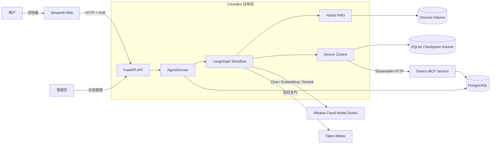

# CleanBot Agent

[](https://github.com/ThalynVeris/cleanbot-agent/actions/workflows/ci.yml)


CleanBot 是面向扫地/扫拖机器人的可评测智能客服 Agent。系统以 LangGraph 编排知识问答、设备月报、环境建议、模拟设备控制、闲聊和超范围拒答六类流程；以 Hybrid RAG 提供可追溯回答；通过 FastAPI + SSE 对外提供流式接口，并使用独立 MCP 服务隔离设备操作。

> 本项目是使用演示数据和模拟设备构建的单实例可部署原型，不代表已接入真实账号、真实硬件或生产流量。

## Demo

<p align="center">
  
</p>

<p align="center"><strong>Hybrid RAG 知识问答：流式输出、耗时与 Token 统计、可追溯来源</strong></p>

| 结构化设备月报 | MCP 设备操作审批 |
|---|---|
| [](docs/assets/demo/monthly-report.jpg) | [](docs/assets/demo/device-approval.jpg) |
| SQL 结构化记录 + RAG 保养建议 | LangGraph 暂停/恢复 + 人工批准/拒绝 |

| 审批后状态变更 | FastAPI OpenAPI 文档 |
|---|---|
| [](docs/assets/demo/device-approved.jpg) | [](docs/assets/demo/api-docs.jpg) |
| 所有权、幂等与操作审计 | SSE、会话、设备和知识库接口 |

完整的演示问题和五分钟验收流程见 **[Demo 展示页](docs/DEMO.md)**。

## 核心能力

| 能力 | 实现 |
|---|---|
| 显式 Agent 工作流 | LangGraph 状态图划分六类意图，确定性节点负责结构化查询、工具调用与失败分支 |
| 多轮与结构化数据 | PostgreSQL/SQLite 持久化用户、会话、消息和月报；加载最近 12 条消息完成指代消解 |
| 可评测 Hybrid RAG | 标题/问答优先切分，Dense + 中文 BM25 双路召回，RRF 融合与条件 Rerank，回答保留来源 |
| MCP 与人工审批 | 独立 Device MCP 提供 5 个工具和设备能力 Resource；写操作经持久化审批后执行 |
| API 与可观测性 | FastAPI、Pydantic 和 SSE；记录请求 ID、首 Token、总耗时、模型调用与可用 Token 统计 |
| 工程交付 | Python 3.10、锁定依赖、SQLAlchemy、Docker Compose、GitHub Actions、自动化测试与故障降级 |

## 量化结果

### 条件 Rerank 策略选择（60 条验证集）

| 策略 | Hit@3 | MRR@5 | 平均检索延迟 | P95 检索延迟 | Rerank 调用 |
|---|---:|---:|---:|---:|---:|
| Always Rerank | 100.00% | 0.9367 | 770.11 ms | 993.72 ms | 50 |
| Conditional Rerank | 100.00% | 0.9800 | 560.09 ms | 794.37 ms | 24 |

在该次验证实验中，条件策略保持 Hit@3 不变，同时将 Rerank 调用减少 **52%**、平均检索延迟降低约 **27.3%**，因此选为最终策略。

### 独立结果（20 条冻结测试集）

| 方案 | Hit@3 | MRR@5 | 平均检索延迟 | P95 检索延迟 |
|---|---:|---:|---:|---:|
| Dense Baseline | 62.50% | 0.5625 | 382.88 ms | 407.80 ms |
| Hybrid + Conditional Rerank | 81.25% | 0.7865 | 637.93 ms | 802.97 ms |

Hybrid RAG 将 Hit@3 提升 **18.75 个百分点**、MRR@5 提升 **0.2240**；代价是平均检索延迟增加 255.05 ms。全量意图识别准确率为 **95%（19/20）**，引用字段映射正确率为 **100%**。结果来自固定数据集的单次外部 API 实测，不代表生产 SLA。

实验设计、限制与原始结果见 **[评测报告](docs/EVALUATION.md)**。

## 架构总览



进一步查看 **[系统架构设计](docs/ARCHITECTURE.md)**：其中包含系统上下文图、容器部署图、组件图、知识问答与设备审批时序图、ER 数据模型图及工程保障说明。

## Docker 快速启动

### 1. 准备环境变量

```bash
cp .env.example .env
```

至少在 `.env` 中配置：

```dotenv
DASHSCOPE_API_KEY=你的百炼APIKey
ADMIN_TOKEN=替换为随机长字符串
DEVICE_MCP_TOKEN=替换为另一个随机长字符串
```

### 2. 启动完整系统

```bash
docker compose up -d --build
docker compose ps
curl http://127.0.0.1:8000/health
```

Compose 启动 `web + api + device-mcp + postgres` 四个服务。首次启动会初始化演示用户、模拟设备、120 条月报和知识库；PostgreSQL、Chroma 与 LangGraph 审批检查点使用独立持久化卷。

- Streamlit：<http://127.0.0.1:8501>
- FastAPI 文档：<http://127.0.0.1:8000/docs>

停止服务：

```bash
docker compose down
```

不要增加 `-v`，否则会同时删除持久化卷。

## 原生开发运行

项目在 Python 3.10 下验证：

```bash
python -m pip install -r requirements.lock
python -m pip install --no-deps -e .
python -m cleanbot.cli init-db
python -m cleanbot.cli ingest
```

分别启动 API 和 Web：

```bash
./scripts/run_api.sh
./scripts/run_web.sh
```

脚本会让本地服务绕过常见的系统/VPN HTTP 代理设置。原生模式默认使用 SQLite 和嵌入式 Chroma；Docker 模式使用 PostgreSQL，并通过独立 Device MCP 容器执行模拟设备工具。

## API

| 方法与路径 | 用途 |
|---|---|
| `POST /api/v1/chat/stream` | 输入 `session_id/user_id/message/month`，返回 SSE 事件流 |
| `GET /api/v1/sessions/{id}/messages` | 恢复持久化会话消息 |
| `GET /api/v1/demo/users/{id}/sessions` | 获取演示用户的历史会话 |
| `GET /api/v1/device/actions/pending` | 按用户和会话恢复待审批操作 |
| `POST /api/v1/device/actions/{id}/decision` | 批准或拒绝模拟设备写操作 |
| `POST /api/v1/knowledge/documents` | 使用 `X-Admin-Token` 上传 TXT/PDF |
| `DELETE /api/v1/knowledge/documents/{id}` | 删除文档及其向量切片 |
| `GET /health` | 检查数据库、向量库、Device MCP、用户数与切片数 |

聊天接口事件顺序为 `status → source → token → done`；设备写操作增加 `approval_required`，异常链路以完整的 `error` 事件结束。

## 测试与复现实验

```bash
python -m ruff check cleanbot tests app.py
python -m pytest --cov=cleanbot --cov-report=term-missing --cov-fail-under=80
```

当前共 **71 项自动化测试**，核心模块覆盖率 **87%**。测试包含多轮会话隔离、10 个并发模拟会话、检索融合与 Rerank 回退、文档幂等更新删除、天气降级、MCP 协议、设备所有权和审批恢复。

复现实验命令、数据划分、参数和统计口径见 [评测报告](docs/EVALUATION.md)。

## 项目结构

```text
cleanbot/
  api/          FastAPI、SSE、上传与健康检查
  core/         配置、模型工厂、Pydantic Schema、日志
  db/           SQLAlchemy 模型与数据访问层
  device_mcp/   模拟设备 MCP Server、Client 与协议边界
  evaluation/   固定评测执行器
  rag/          结构化切分、Chroma、BM25、RRF 与 Rerank
  tools/        外部天气服务适配器
  workflow/     LangGraph、意图路由、审批与流式服务
data/           6 份扫地机器人领域资料
evaluation/     60 条验证集与 20 条冻结测试集
reports/        三份可复现的正式评测结果
tests/          单元测试与集成测试
docs/           Demo、架构设计与评测说明
```

## 已知边界

- Demo 身份由界面选择，不是企业登录鉴权；知识库管理端点使用单一管理员令牌。
- 设备与操作均为模拟数据；MCP 内部共享令牌不等价于真实设备云或企业 OAuth。
- 审批 Checkpointer 使用持久化 SQLite，适合单 API 实例；多副本部署需更换共享 Checkpointer。
- Chroma 采用 API 容器内的单实例持久化目录，不宣称分布式、高可用或多 Worker 并行写入。
- 冻结测试集 Hit@3 为 81.25%，尚未达到 85% 的预设目标；项目保留该真实结果。
- 10 会话并发测试使用模拟模型验证状态隔离，不能等价为真实模型吞吐或生产并发能力。
- 生成回答的 10 条抽样评测使用同供应商模型作为 Judge，存在同源偏差，仅作为辅助信号。

## 文档导航

- [Demo 展示与验收](docs/DEMO.md)
- [系统架构设计](docs/ARCHITECTURE.md)
- [定量评测报告](docs/EVALUATION.md)
- [验证集：Always Rerank](reports/evaluation/development_always.md)
- [验证集：Conditional Rerank](reports/evaluation/development_disagreement.md)
- [冻结测试集](reports/evaluation/heldout_final.md)
