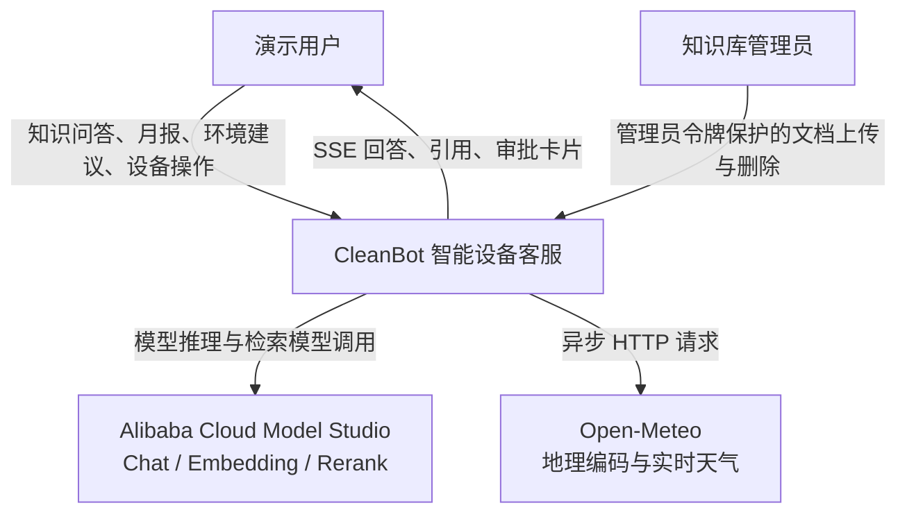
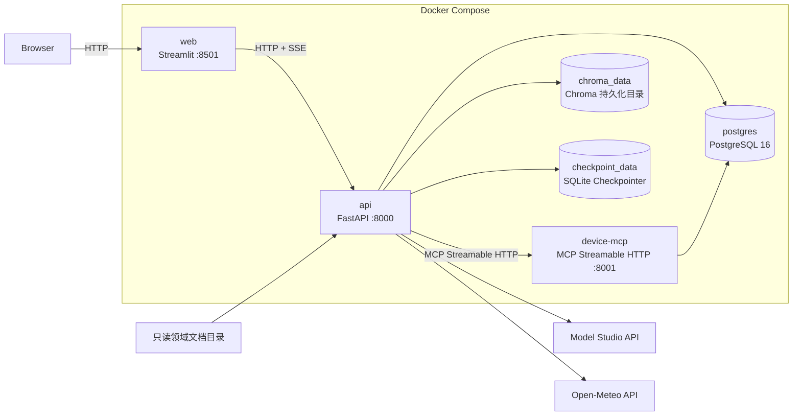
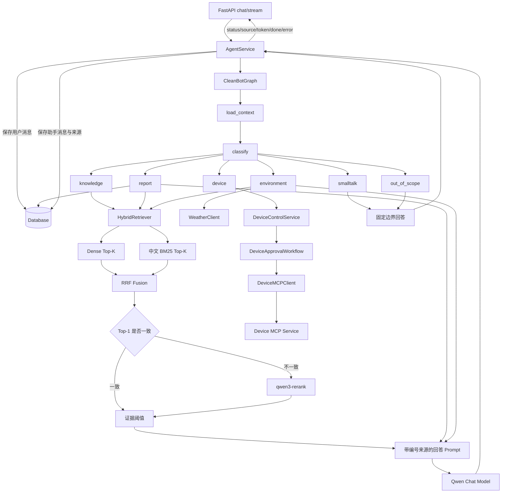
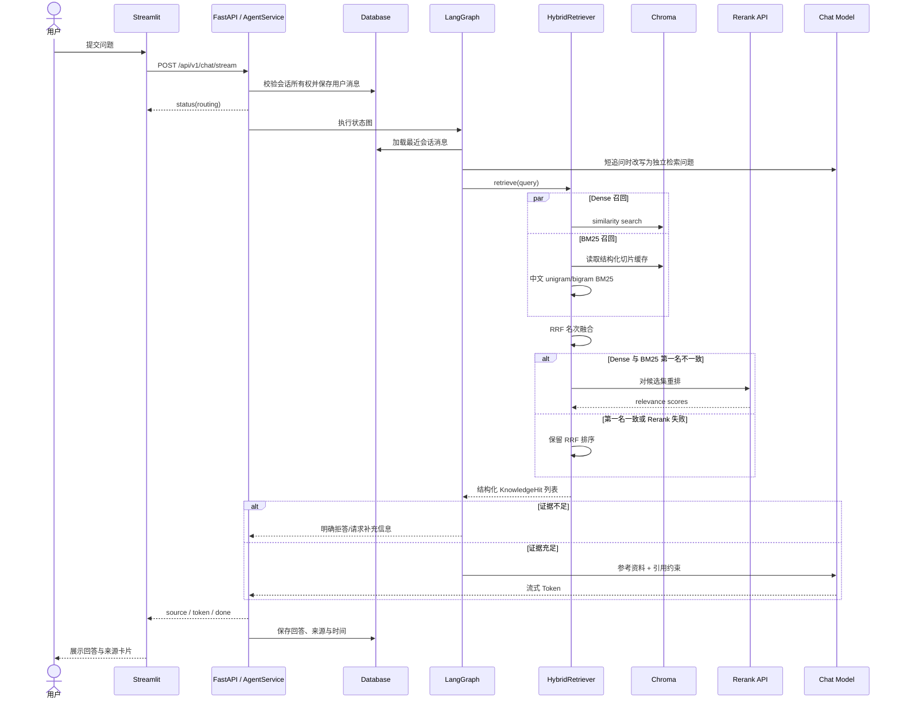
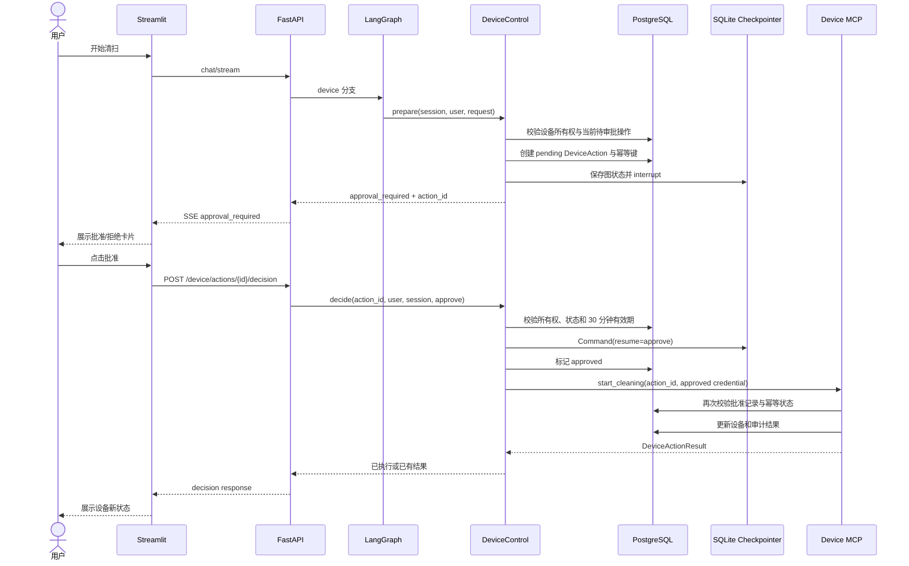
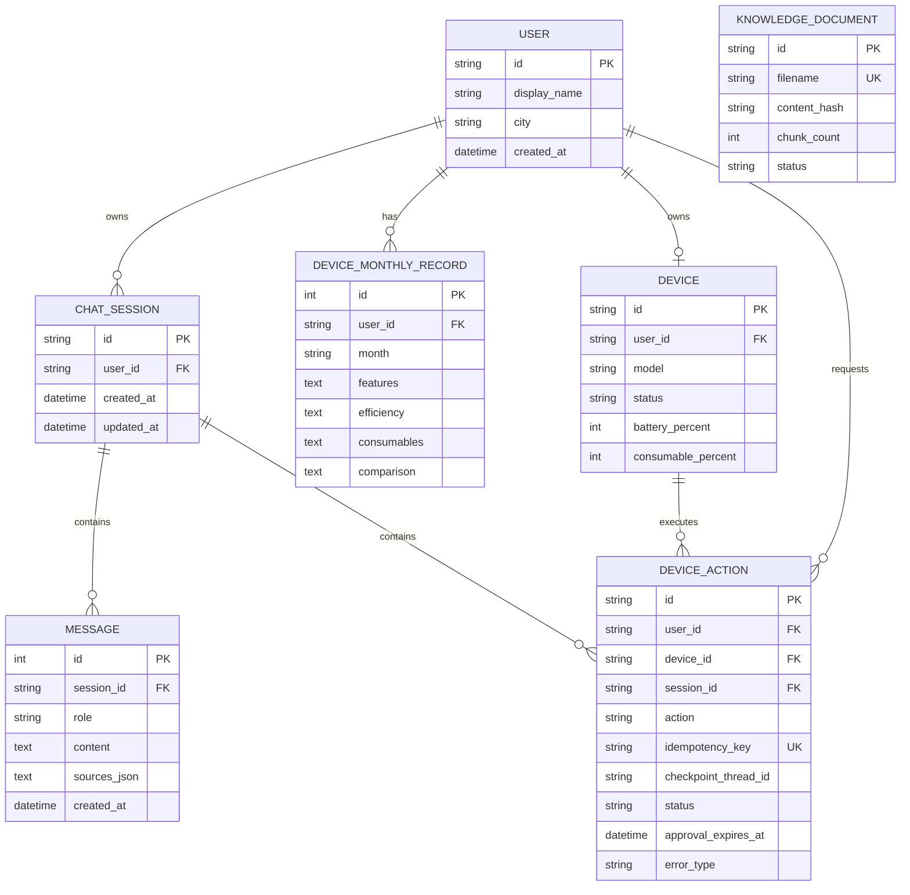

# CleanBot 系统架构设计

本文档描述当前仓库中已经实现并可通过 Docker Compose 复现的架构。系统采用单 API 实例、独立设备 MCP 服务、PostgreSQL 和本地持久化 Chroma；图中不包含尚未实现的基础设施。

## 1. 系统上下文

系统边界：用户与设备均为演示身份和模拟数据；管理员接口使用共享令牌；模型和天气为外部服务。

## 2. 容器与部署

| 容器 | 职责 | 持久化/依赖 |
|---|---|---|
| `web` | 用户、会话选择；流式内容、来源和审批卡片展示 | 无业务状态，依赖 API |
| `api` | API 契约、Agent 编排、RAG、天气与审批恢复 | PostgreSQL、Chroma 卷、Checkpoint 卷 |
| `device-mcp` | 暴露设备 Tool/Resource，校验调用凭证和批准状态 | PostgreSQL |
| `postgres` | 用户、会话、消息、月报、设备、操作审计与文档登记 | `postgres_data` 卷 |

Chroma 当前作为 API 容器内的嵌入式存储使用 `chroma_data` 卷，并不是独立 Chroma Server。设备审批图状态存入独立 SQLite Checkpoint 卷。

## 3. 应用组件与 LangGraph 工作流

六类意图均由显式节点结束，不使用无限制的通用工具循环。能力咨询和明确设备短语优先走确定性规则；模糊表达才调用结构化模型分类，并在低置信度或异常时返回受控结果。

## 4. 知识问答时序

失败原则：查询改写失败时使用用户原问题；Rerank 失败时回退到 RRF；知识证据不足时不调用模型补写事实。

## 5. 设备写操作审批时序

拒绝不会调用 MCP 写工具；重复批准直接返回已有结果；过期、其他用户、其他会话或缺少有效批准的写操作均被拒绝。

## 6. 数据模型

`KnowledgeDocument` 记录文档生命周期；向量切片及其 `document_id/chunk_id/source/page/section/content_hash` 元数据保存在 Chroma 中，因此未与关系表建立数据库外键。

## 7. 工程保障与边界

| 关注点 | 当前机制 |
|---|---|
| 会话隔离 | `session_id` 首次绑定用户；其他用户复用时抛出所有权错误 |
| 持久化 | PostgreSQL 保存业务状态，Chroma 卷保存向量，SQLite Checkpointer 保存审批图状态 |
| 幂等 | 文档内容哈希避免重复索引；设备操作使用唯一幂等键和已有结果回放 |
| 超时与降级 | 天气、模型和 MCP 配置超时；Rerank 回退 RRF；失败不返回伪造天气或设备结果 |
| API 边界 | Pydantic 校验输入输出；管理员令牌保护知识库写接口；MCP 使用独立共享令牌 |
| 可观测性 | 请求 ID、意图、来源数、首 Token、总耗时、模型调用、Token 用量和错误类型 |
| 自动化质量 | CI 使用 Python 3.10，执行 Ruff、全量 pytest，并设置 80% 覆盖率门槛 |

当前原型不提供企业 OAuth、真实设备云接入、多 API 副本、分布式向量数据库或生产级高可用。若扩展为多副本部署，需先将 SQLite Checkpointer 和嵌入式 Chroma 替换为共享服务，并完善鉴权、限流、密钥管理与监控告警。
