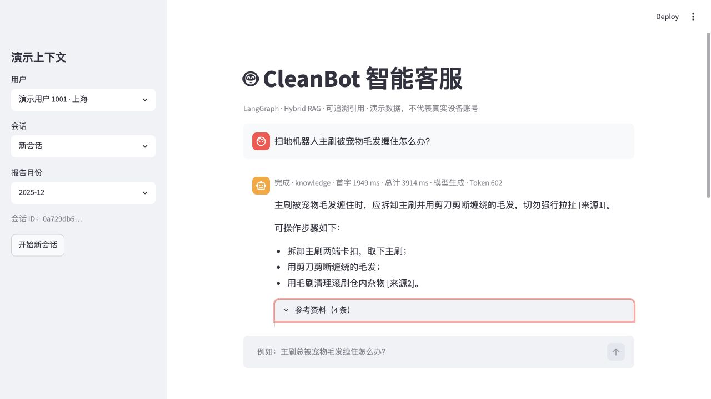
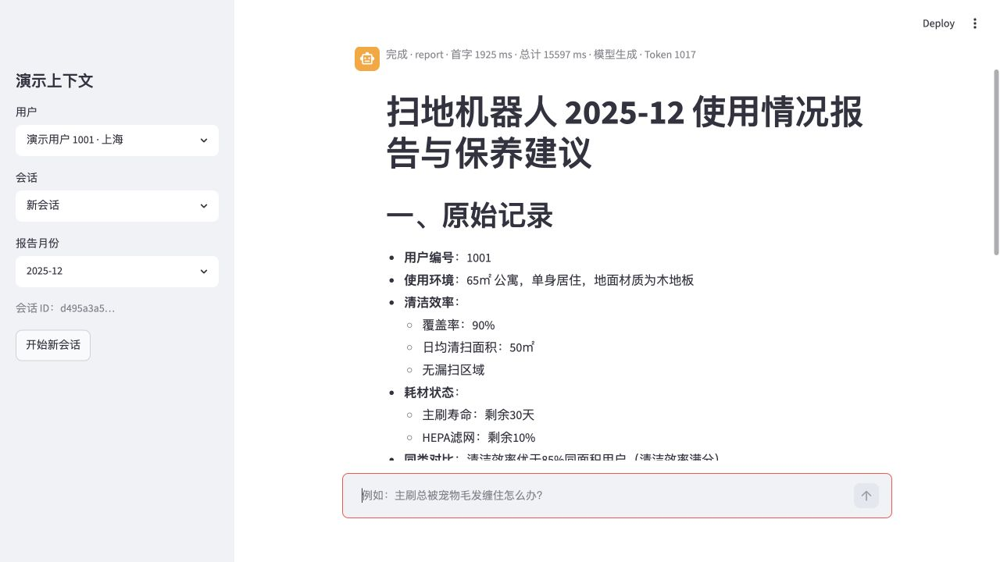
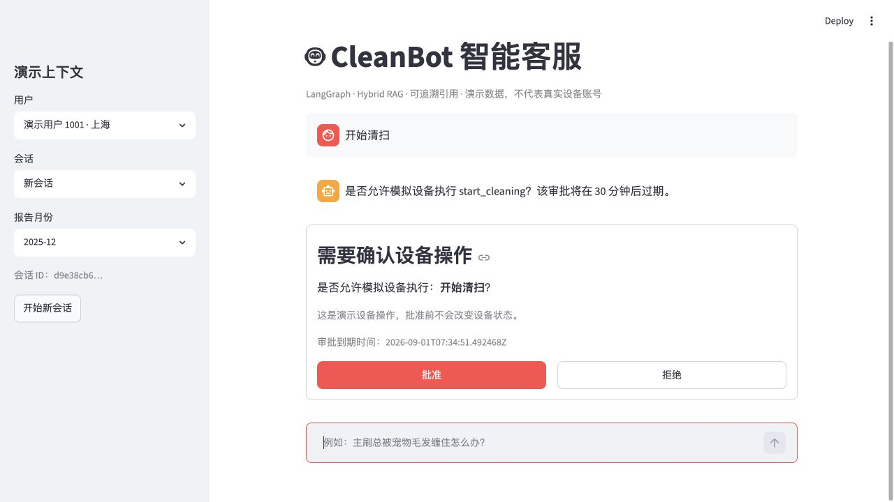
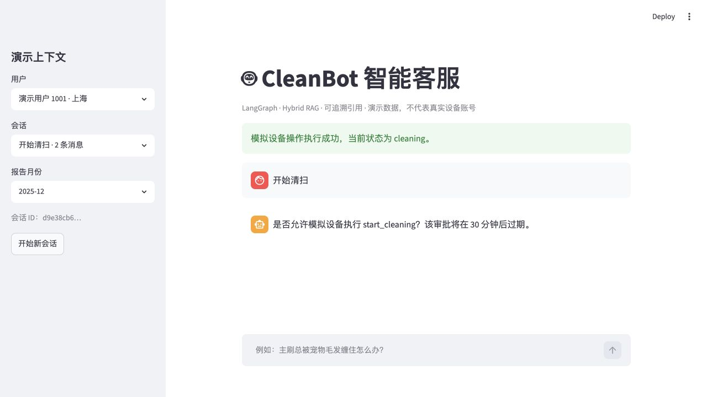
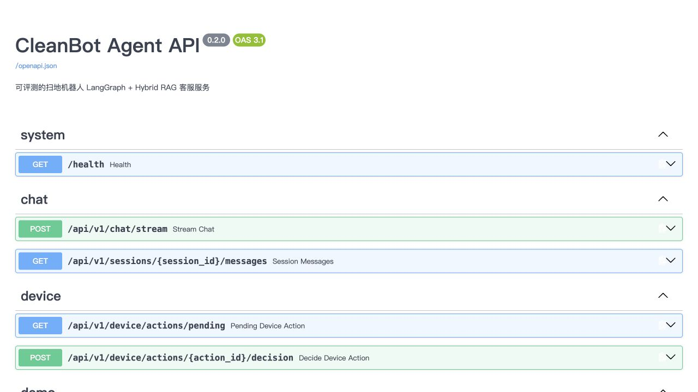

# CleanBot Demo 展示

本页用于在不启动本地环境的情况下，向招聘方展示 CleanBot 的主要产品能力与工程链路。所有截图均来自仓库当前代码的真实运行结果；设备、用户和月报是明确标注的演示数据。

> 本项目没有公网 Demo 地址，也没有接入真实扫地机器人。仓库提供可复现的本地与 Docker Compose 启动方式。

## 1. 混合检索知识问答

演示问题：`扫地机器人主刷被宠物毛发缠住怎么办？`



该链路展示了 Dense 与 BM25 双路召回、RRF 融合、条件 Rerank、带引用回答以及首 Token、总耗时和 Token 用量统计。来源卡片保留文件名、章节、页码和原文片段；证据不足时系统会拒答或请求补充信息。

## 2. 结构化设备月报

演示上下文：用户 `1001`，月份 `2025-12`；演示问题：`生成本月使用报告`。



工作流先从 SQLAlchemy 数据库读取指定用户和月份的结构化记录，再检索对应的保养知识，由模型生成带依据的分析与维护建议。记录不存在时不会生成推测报告。

## 3. MCP 设备写操作与人工审批

演示问题：`开始清扫`。



设备读操作可以直接执行；开始清扫、暂停和回充属于写操作，工作流会通过 LangGraph `interrupt()` 暂停，并持久化待审批动作。只有通过用户、会话、设备所有权和有效期检查后，批准记录才能作为凭证调用 Device MCP 服务。



重复审批返回已有结果，不会重复改变状态；拒绝、过期、所有权不匹配和 MCP 超时都有明确失败结果和自动化测试。

## 4. FastAPI 与 SSE 接口



Streamlit 仅负责交互，业务能力通过 FastAPI 提供。聊天接口返回 `status/source/token/done/error/approval_required` SSE 事件；会话恢复、设备审批和知识库管理均有独立接口及 Pydantic 契约。

## 5. 五分钟本地验收

准备 `.env` 并设置自己的 `DASHSCOPE_API_KEY`、`ADMIN_TOKEN` 和 `DEVICE_MCP_TOKEN`，随后执行：

```bash
docker compose up -d
docker compose ps
curl http://127.0.0.1:8000/health
```

访问：

- Streamlit Demo：<http://127.0.0.1:8501>
- FastAPI 文档：<http://127.0.0.1:8000/docs>

推荐依次验证：

| 场景 | 操作 | 预期结果 |
|---|---|---|
| 知识问答 | 询问主刷毛发缠绕问题 | 返回带 `[来源N]` 的答案和来源卡片 |
| 多轮追问 | 接着问“那宠物家庭呢？” | 结合上一轮语义改写检索问题 |
| 月报 | 选择用户与月份后请求使用报告 | 严格使用对应结构化记录 |
| 设备控制 | 输入“开始清扫” | 出现批准/拒绝确认卡片 |
| 会话恢复 | 切换会话或演示用户 | 恢复对应历史且不串用数据 |
| 服务降级 | 天气或 MCP 服务超时 | 返回明确失败信息，不伪造结果 |

## 6. 可复现结果

- 6 份 TXT/PDF 资料，913 个结构化切片。
- 60 条验证集与 20 条冻结测试集。
- 冻结测试集上，Hybrid RAG + 条件 Rerank 相较 Dense 基线：Hit@3 `62.50% → 81.25%`，MRR@5 `0.5625 → 0.7865`。
- 71 项自动化测试通过，核心覆盖率 `87%`。
- Docker Compose 已验证 `web + api + device-mcp + postgres` 四项服务及持久化卷。

详细指标见[冻结测试集报告](../reports/evaluation/heldout_final.md)，完整设计取舍见[项目精讲与面试手册](项目精讲与面试手册.md)。
